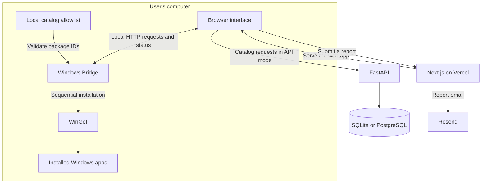

<p align="center">
  
</p>

# BulkStoreInstaller

**Discover Windows applications, build your cart, and install selected apps in one batch.**

[](https://nextjs.org/)
[](https://react.dev/)
[](https://www.typescriptlang.org/)
[](https://tailwindcss.com/)
[](https://fastapi.tiangolo.com/)
[](https://dotnet.microsoft.com/)
[](https://vercel.com/)
[](https://github.com/akilan-27/BulkStoreInstaller/blob/main/LICENSE)

A Windows application discovery and bulk-installation platform built with a Next.js web interface, an optional FastAPI catalog backend, and a local .NET Bridge that runs Microsoft Windows Package Manager (WinGet).

[🌐 Explore Live Application](https://bulk-store-installer.vercel.app/) · [📦 Download Windows Bridge](https://github.com/akilan-27/BulkStoreInstaller/releases/latest) · [💻 GitHub Repository](https://github.com/akilan-27/BulkStoreInstaller) · [🐛 Report an Issue](https://github.com/akilan-27/BulkStoreInstaller/issues)

> **Platform:** Browse the catalog in a modern browser. Installing applications requires a Windows x64 computer, WinGet, and the running BulkStoreInstaller Bridge. Apps selected in a batch are installed sequentially.

---

## Table of Contents

- [About the Project](#about-the-project)
- [Problem Statement](#problem-statement)
- [Solution](#solution)
- [Features](#features)
- [Users and Access](#users-and-access)
- [Screenshots](#screenshots)
- [System Architecture](#system-architecture)
- [Data Architecture](#data-architecture)
- [Technology Stack](#technology-stack)
- [System Requirements](#system-requirements)
- [Getting Started](#getting-started)
- [Local Development](#local-development)
- [Environment Variables](#environment-variables)
- [Project Structure](#project-structure)
- [Application Workflow](#application-workflow)
- [API Overview](#api-overview)
- [Security and Privacy](#security-and-privacy)
- [Deployment Process](#deployment-process)
- [Performance Optimizations](#performance-optimizations)
- [Technical Challenges](#technical-challenges)
- [Learning Outcomes](#learning-outcomes)
- [Current Limitations](#current-limitations)
- [Troubleshooting](#troubleshooting)
- [Future Enhancements](#future-enhancements)
- [Contributing](#contributing)
- [Author](#author)
- [Support](#support)
- [License](#license)

---

## About the Project

BulkStoreInstaller brings application discovery, selection, and installation tracking into one workflow.

Setting up a Windows computer often involves searching for software, visiting multiple websites, downloading installers, and repeating the installation process for each application. BulkStoreInstaller provides a catalog and cart interface for choosing applications together, with a native Bridge handling installation on the user's computer.

The project connects three components:

- **Web interface:** Discover applications, manage selections, and view installation status.
- **Catalog backend:** Serve application metadata, categories, search results, and bundle records when API mode is enabled.
- **Windows Bridge:** Validate selected package identifiers and execute a local WinGet installation queue.

The web interface is available at **[bulk-store-installer.vercel.app](https://bulk-store-installer.vercel.app/)**.

## Problem Statement

Installing several applications manually involves repeated work:

- Finding the correct application and publisher.
- Moving between download websites.
- Running separate installers.
- Checking which applications are already installed.
- Tracking failures and retrying individual installations.
- Repeating the same process after reinstalling Windows or setting up another computer.

A browser also cannot directly execute Windows installation commands. A usable solution needs a clear connection between the web interface and a local Windows process.

## Solution

BulkStoreInstaller combines:

- A searchable Windows application catalog.
- Category filters and sorting.
- A cart for selecting multiple applications.
- Installed-application detection through WinGet.
- A local installation queue with status updates.
- Stop and retry controls.
- A downloadable Windows Bridge distributed through GitHub Releases.

Users choose applications in the browser; the Bridge handles local execution.

## Features

### Application Discovery

- Browse application cards with names, publishers, descriptions, and icons.
- Search by application name, publisher, or description.
- Filter the catalog by category.
- Sort by name, publisher, or category.
- View loading skeletons and empty states.
- Reveal additional applications with **Show More**.

### Multi-App Cart

- Add and remove applications before installation.
- Prevent duplicate cart entries.
- Review selected apps in a dedicated cart drawer.
- Store cart selections in browser local storage.
- Remove successful items from the cart when completing the installation flow.

### Windows Installation Queue

- Submit multiple applications as one batch.
- Validate application IDs and WinGet IDs against the Bridge catalog.
- Install accepted applications one at a time.
- Track completed, failed, and remaining items.
- Surface installation status text and error information.
- Retry failed applications through the installation controls.

### Installed-App Detection

The Bridge runs `winget list --accept-source-agreements`, parses the result, and matches detected package IDs with the catalog. Matching applications can be marked as installed in the interface.

Detection depends on WinGet's available package information and output format.

### Installation Feedback

The Bridge parses WinGet output for preparation, download, installation, and verification-related messages, plus percentages when available.

**The current interface also advances its displayed percentage on a timer, up to 85%, between Bridge updates. Treat the progress bar as an approximate visual indicator, not an exact measurement of downloaded bytes or installation completion.**

Completion and failure handling use the Bridge's reported job results.

### Stop and Retry Controls

- Confirm before requesting **Stop Installation**.
- Request cancellation of the active Bridge job.
- Retry applications reported as failed.
- Keep already completed installations.

Cancellation attempts to stop the active process tree. A third-party installer may continue or leave partial changes; cancellation does not uninstall completed applications.

### Interface and Feedback

- Responsive application grid and navigation.
- Light, dark, and system theme options.
- Framer Motion transitions.
- Toast notifications.
- Fallback visuals for missing application icons.
- Report forms for bugs, missing applications, suggestions, security issues, and general feedback.
- Server-side email delivery through Resend when configured.

### Bundle Support

The codebase includes bundle models, API endpoints, sample bundle data, and a bundle card component. The main page currently centers on the application catalog and cart; a complete bundle-management interface is a future enhancement.

## Users and Access

The current application does not implement account registration, login, or administrator roles.

| User | Available workflow |
|---|---|
| Catalog visitor | Browse, search, filter, sort, and select applications. |
| Windows user with the Bridge running | Check installed apps, submit a batch, and monitor installation status. |
| Developer or maintainer | Maintain catalog data, build the web application, configure the backend, and package Bridge releases. |

Browser access alone does not install software. Installation requires the local Bridge and WinGet on the same computer.

## Screenshots

[Open the live application to explore the interface.](https://bulk-store-installer.vercel.app/)

Screenshot slots are reserved below. Add real captures to `docs/screenshots/`, then enable the corresponding Markdown images in this section.

| View | Suggested filename | What to show |
|---|---|---|
| Application catalog | `catalog.png` | App cards, category navigation, search, and sorting. |
| Cart and selection | `cart.png` | Several selected applications in the cart drawer. |
| Installation status | `installation-progress.png` | A real queue with application states and results. |
| Bridge connection | `bridge-connection.png` | Connection guidance or the connected Bridge state. |

<!--
Add actual screenshots before uncommenting these image links.

### Application Catalog


### Cart and Selection


### Installation Status


### Bridge Connection

-->

## System Architecture



### Web Application

The Next.js application manages catalog browsing, cart state, themes, Bridge communication, and reporting.

Catalog data can come from either bundled JSON files or the FastAPI service.

### Catalog Backend

FastAPI provides application, category, search, and bundle endpoints. SQLModel manages database access, with SQLite as the default and PostgreSQL available through `DATABASE_URL`.

The catalog backend supplies metadata. It does not run installers on the user's computer.

### Windows Bridge

The C# application runs in the Windows system tray and hosts a local HTTP service at:

```text
http://127.0.0.1:4545
```

It validates package selections, runs WinGet, maintains the current job, and provides installation and detection results to the browser.

## Data Architecture

### Storage Responsibilities

| Storage | Purpose |
|---|---|
| `frontend/mock/apps.json` | Bundled application catalog for mock/catalog mode. |
| `frontend/mock/categories.json` | Bundled categories for mock/catalog mode. |
| SQLite or PostgreSQL | Application and bundle records used by FastAPI. |
| Bridge `Assets/catalog.json` | Allowlist of application IDs and WinGet IDs accepted for installation. |
| Browser local storage | Cart selections and theme preference. |
| Bridge process memory | Current installation job, queue, and cached detection results. |

The database is not required for bundled catalog mode. An active installation job is not persisted across Bridge restarts.

### Application Model

The `App` SQLModel defines:

| Field | Type | Purpose |
|---|---|---|
| `id` | String, primary key | Internal application identifier. |
| `wingetId` | String, unique and indexed | WinGet package identifier. |
| `name` | String, indexed | Application name. |
| `publisher` | String | Application publisher. |
| `description` | Optional string | Application description. |
| `category` | String, indexed | Category used for filtering. |
| `iconPlaceholder` | Optional string | Icon reference. |

The frontend catalog supports additional optional fields such as version, approximate size, and a download URL; these are not all defined in the current SQLModel.

### Bundle Model

| Field | Type | Purpose |
|---|---|---|
| `id` | String, primary key | Bundle identifier. |
| `name` | String | Bundle name. |
| `description` | Optional string | Bundle description. |
| `created_at` | Date/time | Creation timestamp. |

`BundleAppLink` joins bundles and applications through `bundle_id` and `app_id`. The API derives `appCount` from the associated applications.

## Technology Stack

| Area | Technologies |
|---|---|
| Web framework | Next.js 15 with App Router and Turbopack |
| UI runtime and language | React 19, TypeScript |
| Styling | Tailwind CSS 4 |
| UI components | shadcn/ui tooling and Base UI |
| Animation | Framer Motion |
| Server-state management | TanStack Query |
| Forms and validation | React Hook Form, Zod |
| Icons and notifications | Lucide React, Sonner |
| Catalog API | Python, FastAPI, Uvicorn |
| Database access | SQLModel, SQLite, PostgreSQL |
| Windows Bridge | C#, .NET 10, ASP.NET Core/Kestrel |
| Desktop integration | Windows Forms system tray |
| Package installation | Microsoft WinGet |
| Windows installer packaging | Inno Setup |
| Report emails | Resend |
| Web hosting | Vercel |
| Version control and distribution | Git, GitHub, GitHub Releases |

## System Requirements

| Workflow | Requirements |
|---|---|
| Browse the website | A modern web browser and internet connection. |
| Install applications | Windows x64, working WinGet, internet access, and the Windows Bridge. |
| Develop the frontend | Node.js compatible with Next.js 15, npm, and Git. |
| Develop the backend | Python 3.10+ and pip; the included Dockerfile uses Python 3.11. |
| Build the Bridge | Windows, .NET 10 SDK, and WinGet for installation testing. |
| Package a Windows installer | Inno Setup and a published Bridge build. |

Individual applications may require administrator approval, additional disk space, or a restart. A self-contained Bridge release does not require end users to install the .NET SDK.

## Getting Started

### For Windows Users

1. Open the [live application](https://bulk-store-installer.vercel.app/).
2. Browse or search for the applications you need.
3. Add applications to the cart.
4. Download `BulkStoreInstallerBridgeSetup.exe` from the [latest release](https://github.com/akilan-27/BulkStoreInstaller/releases/latest).
5. Install and launch the Bridge; confirm that its system tray icon is present.
6. Return to the website and check the Bridge connection.
7. Review your cart and start installation.
8. Keep the Bridge running and the browser tab open to view updates.
9. Review the results and retry failed items if needed.

The latest release inspected for this documentation is **1.2.0**. The latest-release link above follows future published releases.

## Local Development

### 1. Clone the Repository

```bash
git clone https://github.com/akilan-27/BulkStoreInstaller.git
cd BulkStoreInstaller
```

### 2. Configure the Frontend

Create `frontend/.env.local`:

```env
NEXT_PUBLIC_USE_MOCK=true
NEXT_PUBLIC_API_URL=http://localhost:8000

BRIDGE_DOWNLOAD_URL=https://github.com/akilan-27/BulkStoreInstaller/releases/latest/download/BulkStoreInstallerBridgeSetup.exe

RESEND_API_KEY=replace_with_your_resend_api_key
```

Replace the Resend placeholder with your own key before using the report route or building the unchanged application. The route currently constructs the Resend client at module load; its later simulated-success branch does not make missing-key initialization reliable.

For development without email, first make Resend initialization conditional or disable the report route. No real API key should be committed.

### 3. Install Dependencies and Run Next.js

From the repository root:

```bash
cd frontend
npm ci
npm run dev
```

Open [http://localhost:3000](http://localhost:3000).

`NEXT_PUBLIC_USE_MOCK=true` selects the bundled catalog. It does **not** simulate installation: the install flow still communicates with the local Windows Bridge.

Available frontend scripts:

| Command | Purpose |
|---|---|
| `npm run dev` | Start the development server with Turbopack. |
| `npm run build` | Build the production application. |
| `npm run start` | Serve a previously built production application. |
| `npm run lint` | Run ESLint. |

### 4. Run the FastAPI Backend — Optional

Skip this step when using the bundled catalog.

In a new terminal, from the repository root:

```bash
cd backend
python -m venv .venv
```

On Windows PowerShell:

```powershell
.venv/Scripts/python.exe -m pip install -r requirements.txt
.venv/Scripts/python.exe -m uvicorn app.main:app --reload --host 127.0.0.1 --port 8000
```

On macOS or Linux:

```bash
.venv/bin/python -m pip install -r requirements.txt
.venv/bin/python -m uvicorn app.main:app --reload --host 127.0.0.1 --port 8000
```

The backend defaults to `backend/appstore.db` when started from the backend directory. Startup creates missing tables and attempts to seed an empty database from the sibling frontend catalog.

- [API health](http://127.0.0.1:8000/api/health)
- [Interactive API documentation](http://127.0.0.1:8000/docs)

To use this API, update `frontend/.env.local` and restart Next.js:

```env
NEXT_PUBLIC_USE_MOCK=false
NEXT_PUBLIC_API_URL=http://localhost:8000
```

### 5. Run the Windows Bridge from Source

Use a Windows terminal. Stop any installed Bridge instance first.

From the repository root:

```powershell
cd windows-bridge/src/BulkStoreInstaller.Bridge
dotnet restore
dotnet run --configuration Release
```

Check [http://127.0.0.1:4545/health](http://127.0.0.1:4545/health).

The Bridge uses port `4545`; running two instances or another service on that port can prevent startup.

### 6. Publish and Package the Bridge

From the Bridge project directory:

```powershell
dotnet publish --configuration Release --runtime win-x64 --self-contained true
```

Publish output is produced under:

```text
windows-bridge/src/BulkStoreInstaller.Bridge/bin/Release/net10.0-windows/win-x64/publish/
```

Keep the accompanying `Assets/catalog.json` with the executable.

Compile `windows-bridge/installer/BulkStoreInstallerBridge.iss` using Inno Setup. The script packages the published files into `BulkStoreInstallerBridgeSetup.exe`.

## Environment Variables

| Variable | Location or scope | Purpose |
|---|---|---|
| `NEXT_PUBLIC_USE_MOCK` | `frontend/.env.local` or Vercel | Set to `true` for bundled catalog data; otherwise use FastAPI. |
| `NEXT_PUBLIC_API_URL` | `frontend/.env.local` or Vercel | FastAPI base URL; defaults to `http://localhost:8000`. |
| `NEXT_PUBLIC_COMPANION_URL` | Frontend configuration | Present in configuration, but not used by the active Bridge client. |
| `BRIDGE_DOWNLOAD_URL` | Next.js server environment | Installer destination used by `/api/download/bridge`. |
| `RESEND_API_KEY` | Next.js server environment | Resend client initialization and report-email delivery. |
| `DATABASE_URL` | Backend process environment | Database connection string; defaults to `sqlite:///./appstore.db`. |

**Configuration notes:**

- Put Next.js variables in `frontend/.env.local`; the repository-root example is a reference.
- `NEXT_PUBLIC_*` values are exposed to the browser and must not contain secrets.
- The active client currently hardcodes `http://127.0.0.1:4545`. Changing `NEXT_PUBLIC_COMPANION_URL` alone will not change its endpoint.
- Export `DATABASE_URL` into the backend process or configure it through the deployment platform. The current database module reads the process environment.
- Restart development servers after changing local configuration. Rebuild/redeploy the frontend after changing public build-time values.

## Project Structure

| Path | Responsibility |
|---|---|
| `frontend/app/` | Next.js page, layout, global styles, and server routes. |
| `frontend/app/api/download/bridge/` | Bridge installer redirect. |
| `frontend/app/api/report/` | Feedback and report-email endpoint. |
| `frontend/components/` | Cards, dialogs, cart, navigation, feedback, and UI primitives. |
| `frontend/contexts/` | Cart, theme, and query providers. |
| `frontend/hooks/` | Catalog queries, search, Bridge state, and install actions. |
| `frontend/lib/bridge/client.ts` | Browser-to-Bridge HTTP client. |
| `frontend/services/api.ts` | Bundled-catalog and FastAPI data access. |
| `frontend/mock/` | Bundled application and category data. |
| `frontend/public/` | Public assets and application icons. |
| `frontend/types/` | TypeScript application and installation types. |
| `backend/app/` | FastAPI startup, models, database access, routers, and services. |
| `backend/scripts/` | Catalog, icon, and data-maintenance utilities. |
| `backend/static/` | Backend-served static assets. |
| `windows-bridge/src/BulkStoreInstaller.Bridge/` | Native Bridge application. |
| `windows-bridge/src/BulkStoreInstaller.Bridge/Services/` | Catalog validation, queue processing, detection, and WinGet output parsing. |
| `windows-bridge/src/BulkStoreInstaller.Bridge/Assets/` | Bundled Bridge catalog. |
| `windows-bridge/installer/` | Inno Setup installer definition. |
| `LICENSE` | MIT license terms. |

## Application Workflow

1. The browser loads the web interface.
2. The frontend reads bundled catalog data or requests it from FastAPI.
3. The user searches, filters, and adds applications to the cart.
4. The frontend checks the local Bridge connection.
5. The Bridge checks installed applications through WinGet.
6. The user starts the selected batch.
7. The Bridge admits selections whose application ID and WinGet ID match its catalog.
8. WinGet installs accepted applications sequentially.
9. The frontend polls the Bridge for job updates, normally every second during an active job.
10. The interface displays results and offers stop or retry actions.
11. Installed-app data is refreshed, and successful items can be removed from the cart.

## API Overview

### Catalog Backend

Base URL during local development: `http://localhost:8000`.

| Method | Endpoint | Purpose |
|---|---|---|
| GET | `/api/health` | API health response. |
| GET | `/api/apps` | List apps with category, sorting, and pagination parameters. |
| GET | `/api/apps/batch?ids=...` | Retrieve apps by internal IDs. |
| GET | `/api/categories` | List categories. |
| GET | `/api/categories/counts` | Count apps by category. |
| GET | `/api/search?q=...` | Search application metadata. |
| GET | `/api/bundles` | List bundles. |
| POST | `/api/bundles` | Create a bundle. |

### Local Windows Bridge

Base URL: `http://127.0.0.1:4545`.

| Method | Endpoint | Purpose |
|---|---|---|
| GET | `/health` | Service metadata and active-job information. |
| POST | `/install` | Submit a catalog-validated installation batch. |
| GET | `/status` | Read the current job. |
| POST | `/cancel` | Request job cancellation. |
| POST | `/verify` | Match requested apps against installed WinGet IDs. |

Bridge operations other than health expect:

```http
X-BulkStoreInstaller-Client: web-v1
```

This fixed header is a client marker, not a secret authentication token.

### Next.js Server Routes

| Method | Endpoint | Purpose |
|---|---|---|
| GET | `/api/download/bridge` | Redirect to the configured installer URL; return 503 if unset. |
| POST | `/api/report` | Validate basic report fields and send a report through Resend. |

## Security and Privacy

### Implemented Controls

- **Loopback listener:** The Bridge listens locally through Kestrel.
- **Host validation:** Requests are limited to the expected local host values.
- **Catalog validation:** Only matching application ID and WinGet ID pairs enter the installation queue.
- **Structured arguments:** WinGet receives arguments through `ProcessStartInfo.ArgumentList` with shell execution disabled.
- **Client marker:** Installation, status, cancellation, and verification requests must include the expected header.
- **Report throttling:** The report route has an in-memory request limit.
- **Server-side email key:** Resend credentials belong in the Next.js server environment.

### Current Boundaries

The Bridge currently accepts all browser origins in its CORS policy, and the client marker is publicly known. These controls do not authenticate a user or establish trusted browser pairing. Exact origin restrictions and authenticated pairing remain necessary improvements.

The FastAPI service also has permissive CORS and no account-based authorization. In particular, protect the bundle-write endpoint before exposing it as a shared production service.

Cart and theme settings are stored in the browser. Installed-package information is obtained locally and returned to the web interface. Submitting a report sends the entered report information through the configured email service.

## Deployment Process

### Frontend on Vercel

1. Import [the GitHub repository](https://github.com/akilan-27/BulkStoreInstaller).
2. Set the project **Root Directory** to `frontend`.
3. Select the **Next.js** framework preset.
4. Use `npm run build` as the build command and the default Next.js output handling.
5. Set catalog mode, installer URL, and report-email configuration.
6. Deploy and check catalog loading, icons, the Bridge download link, and reporting.

For bundled catalog mode:

```env
NEXT_PUBLIC_USE_MOCK=true
```

For API mode:

```env
NEXT_PUBLIC_USE_MOCK=false
NEXT_PUBLIC_API_URL=https://your-api.example.com
```

Replace the example API domain with the actual backend URL. The Windows Bridge must run on each user's computer.

### Backend Deployment

Deploy the FastAPI service separately using the included Dockerfile or a Python-capable host.

Configure `DATABASE_URL`, restrict CORS to the intended frontend, and ensure database persistence. The development Docker Compose file includes PostgreSQL; replace its example credentials for deployment.

For an empty database, ensure that seed data is available in the deployed environment. The startup seeder expects the sibling `frontend/mock/apps.json` file, which a backend-only Docker build does not automatically include.

### Bridge Distribution

1. Build and publish the Bridge on Windows.
2. Compile the Inno Setup installer.
3. Test installation and the browser connection on Windows.
4. Upload the installer as a GitHub Release asset.
5. Point `BRIDGE_DOWNLOAD_URL` at the intended asset.
6. Keep the frontend catalog and Bridge catalog aligned.

The report route currently contains a fixed sender and recipient. Configure those values for your own Resend account or verified domain before deploying a fork.

## Performance Optimizations

The current implementation includes:

| Technique | Benefit |
|---|---|
| TanStack Query caching | Reuses catalog, category, and search responses. |
| Debounced search | Waits 300 ms before starting a search query. |
| Initial 100-card rendering | Limits the first render; Show More reveals the remaining results. |
| Lazy-loaded icons | Defers image loading until needed. |
| Memoized icon component and cart ID set | Reduces repeated work in common UI operations. |
| Conditional status polling | Polls frequently during an active job and less often or not at all when idle. |
| Short-lived installed-app cache | Reduces repeated WinGet list executions. |

Performance measurements and benchmark scores have not been added to this README.

## Technical Challenges

The main engineering challenges in this project are:

- Connecting an HTTPS web interface to a loopback Windows service.
- Handling CORS preflight and browser local-network permissions.
- Separating catalog IDs from WinGet package identifiers.
- Keeping frontend, database, and Bridge catalog copies consistent.
- Parsing varied WinGet output and installer behavior.
- Managing sequential jobs, cancellation, retries, and UI state.
- Packaging a tray application with its required catalog assets.
- Maintaining a responsive interface across larger application catalogs.

## Learning Outcomes

The project demonstrates practical work with:

- React component architecture and TypeScript data models.
- Next.js server routes and frontend deployment.
- TanStack Query, browser storage, and asynchronous UI state.
- REST APIs, SQLModel, and relational data.
- C# background processes and Windows system tray integration.
- WinGet process execution and output parsing.
- Browser-to-local-service communication.
- GitHub release distribution and Windows installer packaging.

## Current Limitations

- **Approximate progress:** The UI includes timer-generated percentages.
- **Health reporting:** The Bridge health response currently hardcodes its version and WinGet availability fields; it is not a complete runtime diagnostic.
- **Origin and pairing controls:** Browser-origin restrictions and authenticated pairing are not yet implemented.
- **Cancelled states:** The frontend's status mapping does not preserve every native cancelled state distinctly.
- **Job persistence:** Queue state is lost when the Bridge restarts.
- **Catalog synchronization:** A frontend item must also match the Bridge's bundled catalog to be installed.
- **Report configuration:** Resend initialization requires attention when running without an API key; rate limiting is process-local.
- **Bundle interface:** API support exists, but the main UI does not yet provide a full bundle-management workflow.

These are implementation details to consider when testing or extending the project. Roadmap items below describe planned improvements, not completed functionality.

## Troubleshooting

| Issue | What to check |
|---|---|
| No applications appear | Confirm `NEXT_PUBLIC_USE_MOCK`. In API mode, verify the API URL, health endpoint, CORS, and database contents. |
| Bridge appears offline | Confirm that the tray application is running and `http://127.0.0.1:4545/health` responds. Check port conflicts and browser local-network permission. |
| WinGet is unavailable | Run `winget --version` in a Windows terminal and repair or install Microsoft App Installer if needed. |
| An application is rejected | Check that its internal ID and WinGet ID match the Bridge catalog. |
| Installation fails | Review the reported error, package availability, network access, and any required Windows approval. |
| Progress appears stuck or inaccurate | Installer output varies, and current percentages include a UI simulation. Review the final Bridge result. |
| Stop does not undo an installation | Cancellation is not a rollback; completed installations remain and some installer processes may continue. |
| Bridge download returns 503 | Set a valid `BRIDGE_DOWNLOAD_URL` and redeploy. |
| Build or reporting fails with “Missing API key” | Configure `RESEND_API_KEY` or make Resend initialization conditional for no-email development. |
| Report email does not arrive | Check Resend configuration, permitted sender/recipient settings, and the server response. |
| Fresh backend has no catalog | Confirm seed data is available; the backend-only Docker context does not contain the sibling frontend directory. |

## Future Enhancements

- [ ] Replace simulated percentages with measured progress and indeterminate states.
- [ ] Add exact browser-origin restrictions and authenticated Bridge pairing.
- [ ] Check WinGet availability dynamically in health responses.
- [ ] Preserve cancelled states consistently across the Bridge and frontend.
- [ ] Add durable job history and clearer recovery after restarts.
- [ ] Synchronize and version catalog updates across components.
- [ ] Complete the bundle creation and management interface.
- [ ] Add Authenticode signing and checksum publication to the release process.
- [ ] Automate Windows installer builds and release validation.
- [ ] Add Bridge update detection.
- [ ] Improve report validation, conditional email initialization, and persistent rate limiting.
- [ ] Add end-to-end tests covering the web interface and native Bridge.
- [ ] Add verified product screenshots and measured performance results.

## Contributing

Contributions, bug reports, and practical improvements are welcome.

1. Fork the repository and create a focused branch.
2. Make the change and update any affected documentation.
3. Run the relevant frontend checks.
4. Test Bridge changes on Windows with WinGet available.
5. Open a pull request describing the problem, solution, and validation.

Frontend checks, from `frontend/`:

```bash
npm run lint
npm run build
```

Include operating system, browser, Bridge version, and reproduction steps when reporting installation or connection issues. Remove secrets and personal information from shared logs.

## Author

**Akilan R**

AI and Data Science student interested in software development, full-stack applications, and practical automation.

- [GitHub — akilan-27](https://github.com/akilan-27)
- [BulkStoreInstaller Repository](https://github.com/akilan-27/BulkStoreInstaller)
- [Live Application](https://bulk-store-installer.vercel.app/)

## Support

If BulkStoreInstaller is useful to you, consider giving the repository a ⭐, reporting reproducible issues, or contributing improvements.

## License

This project is licensed under the **MIT License**. See the repository's [LICENSE](https://github.com/akilan-27/BulkStoreInstaller/blob/main/LICENSE) for the complete terms.

Third-party applications retain their own licenses and publisher terms. BulkStoreInstaller is an independent project and is not affiliated with or endorsed by Microsoft.

---

**Built by [Akilan](https://github.com/akilan-27) · [Live Application](https://bulk-store-installer.vercel.app/) · [Latest Windows Bridge](https://github.com/akilan-27/BulkStoreInstaller/releases/latest)**

<!--
Documentation prepared from the repository source on 2026-09-22.
This README documents source behavior; it is not an end-to-end test report.
Key source references:
- frontend/package.json
- frontend/app/page.tsx
- frontend/components/dialogs/InstallDialog.tsx
- frontend/lib/bridge/client.ts
- frontend/services/api.ts
- frontend/app/api/report/route.ts
- backend/app/models.py
- backend/app/database.py
- windows-bridge/src/BulkStoreInstaller.Bridge/BridgeServer.cs
- windows-bridge/src/BulkStoreInstaller.Bridge/Services/InstallQueueService.cs
-->

