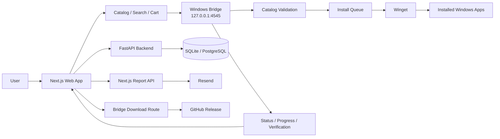

<div align="center">


# BulkStoreInstaller

**A modern Windows app discovery and bulk-installation platform powered by Next.js, .NET, FastAPI, and Winget.**

[](https://bulk-store-installer.vercel.app/)
[](https://github.com/akilan-27/BulkStoreInstaller/releases/tag/1.2.0)
[](LICENSE)

<br />

Browse applications, add multiple apps to your cart, and install them on Windows through a lightweight local bridge that securely executes validated Winget commands.

</div>

---

## ✨ Overview

**BulkStoreInstaller** makes Windows setup faster by combining a polished web interface with a native local installation bridge.

Instead of downloading software manually from many different websites, users can:

- browse a curated catalog,
- search and filter apps,
- add multiple apps to a cart,
- detect apps already installed,
- start a batch installation,
- track real Winget-driven progress,
- cancel or retry installation jobs.

The browser never directly runs Windows commands. Installation is handled by **BulkStoreInstaller Bridge**, a local .NET application that listens only on the user's machine and runs validated Winget package IDs.

---

## 🖼️ Screenshots

> Add project screenshots here to showcase the product visually.

<table>
  <tr>
    <td align="center"><b>Application Catalog</b></td>
    <td align="center"><b>Cart & Selection</b></td>
  </tr>
  <tr>
    <td width="50%" align="center">
      <br />
      <i>Add screenshot: docs/screenshots/catalog.png</i>
      <br /><br />
    </td>
    <td width="50%" align="center">
      <br />
      <i>Add screenshot: docs/screenshots/cart.png</i>
      <br /><br />
    </td>
  </tr>
  <tr>
    <td align="center"><b>Installation Progress</b></td>
    <td align="center"><b>Bridge Connection</b></td>
  </tr>
  <tr>
    <td width="50%" align="center">
      <br />
      <i>Add screenshot: docs/screenshots/install-progress.png</i>
      <br /><br />
    </td>
    <td width="50%" align="center">
      <br />
      <i>Add screenshot: docs/screenshots/bridge-status.png</i>
      <br /><br />
    </td>
  </tr>
</table>

<!--
When screenshots are ready, replace the placeholders above with:


-->

---

## 🚀 Core Features

### App discovery
- Curated Windows application catalog
- Search by app name, publisher, or description
- Category filtering and sorting
- Responsive application cards
- Progressive rendering for larger catalogs
- Loading skeletons and empty states

### Multi-app cart
- Add several apps before installation
- Remove apps before starting
- Review all selected apps in one place
- Keep browsing while managing the install queue

### Installed app detection
When the Windows Bridge is connected, BulkStoreInstaller checks locally installed packages using:

```bash
winget list --accept-source-agreements
```

Detected Winget IDs are mapped back to the catalog so already-installed apps can be identified in the UI.

### Real installation progress
The bridge parses actual Winget output and maps it to stages such as:

```text
Preparing → Downloading → Installing → Verifying → Completed
```

When Winget reports a percentage, BulkStoreInstaller displays that progress instead of using fake timers.

### Sequential install queue
Users can select multiple apps in one batch, while the bridge installs them sequentially for better reliability and easier tracking.

Possible states include:

```text
Pending
Installing
Success
Failed
Cancelled
```

### Cancel and retry
- Cancel an active installation job
- Stop the current Winget process when possible
- Preserve already completed installs
- Retry failed items from the frontend

### Bridge health handling
The frontend handles states such as:

- connected
- offline
- timed out
- version mismatch
- Winget unavailable
- unauthorized
- configuration error

### Feedback and reporting
A Next.js server route supports:

- bug reports
- missing app reports
- suggestions
- security reports
- general feedback

Email delivery is powered by **Resend** when configured.

---

## 🏗️ Architecture



### Installation flow

```text
1. User opens BulkStoreInstaller.
2. User browses or searches applications.
3. User adds apps to the cart.
4. Frontend checks whether the local Windows Bridge is running.
5. Selected app IDs and Winget IDs are sent to the bridge.
6. Bridge validates each app against its bundled catalog.
7. Bridge creates an installation job.
8. Apps are installed one by one through Winget.
9. Winget output is parsed into stages and progress.
10. Frontend polls the bridge while the job is active.
11. Installed-app status is refreshed when the job finishes.
```

---

## 🧩 Project Components

### Frontend

Located in:

```text
frontend/
```

Built with:

- Next.js 15
- React 19
- TypeScript
- Tailwind CSS 4
- shadcn/ui / Base UI
- Framer Motion
- TanStack Query
- React Hook Form
- Zod
- Lucide React
- Lenis

Responsibilities:

- catalog browsing
- search and filters
- cart state
- theme handling
- bridge communication
- installed-app verification
- install status polling
- feedback/report UI
- bridge download routing

### Backend

Located in:

```text
backend/
```

Built with:

- FastAPI
- SQLModel
- Uvicorn
- Pydantic
- SQLite
- PostgreSQL support
- HTTPX
- APScheduler

Main API areas:

```text
/api/apps
/api/categories
/api/search
/api/bundles
/api/health
```

### Windows Bridge

Located in:

```text
windows-bridge/
```

Built with:

- .NET 10
- C#
- ASP.NET Core / Kestrel
- Windows Forms system tray
- Winget
- Inno Setup

Bridge configuration:

```text
Target: net10.0-windows
Runtime: win-x64
Self-contained: true
Single-file publish: true
Local endpoint: http://127.0.0.1:4545
```

---

## 🛡️ Security Model

BulkStoreInstaller separates the web interface from native Windows execution.

### Loopback-only bridge
The bridge listens on:

```text
127.0.0.1:4545
localhost:4545
```

It is not designed to expose its installation API publicly on the network.

### Catalog allowlist
Before an install is accepted, the bridge validates both the application ID and Winget package ID against:

```text
Assets/catalog.json
```

This prevents the install endpoint from acting as a general-purpose command executor.

### Structured command arguments
Winget arguments are supplied through `.ArgumentList` instead of concatenating an arbitrary shell command.

### Client marker
Protected bridge operations expect:

```text
X-BulkStoreInstaller-Client: web-v1
```

> The current client marker is an identification mechanism, not a secret authentication credential.

---

## ⚙️ Winget Command

Each validated package is installed using the equivalent of:

```bash
winget install   --id <PACKAGE_ID>   --exact   --accept-package-agreements   --accept-source-agreements   --disable-interactivity
```

---

## 🧰 Tech Stack

| Area | Technology |
|---|---|
| Frontend | Next.js 15 |
| UI Runtime | React 19 |
| Language | TypeScript |
| Styling | Tailwind CSS 4 |
| UI Components | shadcn/ui / Base UI |
| Animation | Framer Motion |
| Data Fetching | TanStack Query |
| Forms | React Hook Form + Zod |
| Icons | Lucide React |
| Backend | FastAPI |
| ORM | SQLModel |
| Database | SQLite / PostgreSQL |
| Windows Bridge | .NET 10 / C# |
| Local Server | ASP.NET Core Kestrel |
| Windows Integration | Windows Forms |
| Package Manager | Microsoft Winget |
| Installer | Inno Setup |
| Hosting | Vercel |
| Email | Resend |

---

## 📦 Current Windows Bridge Release

**Version:** `1.2.0`  
**Installer:** `BulkStoreInstallerBridgeSetup.exe`  
**Platform:** Windows x64

[Download the latest Bridge release](https://github.com/akilan-27/BulkStoreInstaller/releases/tag/1.2.0)

SHA-256:

```text
858de0cf33ebf30ebdec3e8a801a78eba528eaac24f9c66cb7fd7d819bb8ef56
```

---

## 🖥️ Requirements

### End users
- Windows
- Winget / Windows Package Manager
- Modern web browser
- BulkStoreInstaller Bridge

### Frontend development
- Node.js 20+
- npm
- Git

### Backend development
- Python 3.10+
- pip

### Bridge development
- Windows
- .NET 10 SDK
- Winget
- Inno Setup for packaging

---

## 🔧 Local Development

### 1. Clone

```bash
git clone https://github.com/akilan-27/BulkStoreInstaller.git
cd BulkStoreInstaller
```

### 2. Frontend

```bash
cd frontend
npm install
npm run dev
```

Open:

```text
http://localhost:3000
```

Example `frontend/.env.local`:

```env
NEXT_PUBLIC_API_URL=http://localhost:8000
NEXT_PUBLIC_USE_MOCK=true

BRIDGE_DOWNLOAD_URL=https://github.com/akilan-27/BulkStoreInstaller/releases/download/1.2.0/BulkStoreInstallerBridgeSetup.exe

RESEND_API_KEY=
```

### 3. Backend

```bash
cd backend
python -m venv .venv
```

Windows:

```bash
.venv\Scripts\activate
```

Install dependencies and start FastAPI:

```bash
pip install -r requirements.txt
uvicorn app.main:app --reload --host 127.0.0.1 --port 8000
```

API health:

```text
http://127.0.0.1:8000/api/health
```

Swagger docs:

```text
http://127.0.0.1:8000/docs
```

### 4. Windows Bridge

```bash
cd windows-bridge/src/BulkStoreInstaller.Bridge

dotnet restore
dotnet build -c Release
dotnet run
```

Bridge health:

```text
http://127.0.0.1:4545/health
```

Publish:

```bash
dotnet publish -c Release -r win-x64 --self-contained true
```

---

## 🔐 Environment Variables

| Variable | Scope | Purpose |
|---|---|---|
| `NEXT_PUBLIC_API_URL` | Frontend | FastAPI base URL |
| `NEXT_PUBLIC_USE_MOCK` | Frontend | Enables mock catalog mode |
| `NEXT_PUBLIC_COMPANION_URL` | Frontend config | Intended bridge URL configuration |
| `BRIDGE_DOWNLOAD_URL` | Next.js server | Windows Bridge installer redirect target |
| `RESEND_API_KEY` | Next.js server | Report-email delivery |
| `DATABASE_URL` | FastAPI | Overrides SQLite with another database |

> The current bridge client still uses `http://127.0.0.1:4545` directly. Updating `NEXT_PUBLIC_COMPANION_URL` alone does not currently change that endpoint.

---

## 📁 Project Structure

```text
BulkStoreInstaller/
├── frontend/
│   ├── app/
│   ├── components/
│   ├── constants/
│   ├── contexts/
│   ├── hooks/
│   ├── lib/
│   │   └── bridge/
│   ├── mock/
│   ├── services/
│   └── types/
│
├── backend/
│   ├── app/
│   │   ├── routers/
│   │   └── services/
│   ├── scripts/
│   ├── static/
│   ├── Dockerfile
│   └── requirements.txt
│
├── windows-bridge/
│   ├── installer/
│   ├── dist/
│   └── src/
│       └── BulkStoreInstaller.Bridge/
│           ├── Assets/
│           ├── Models/
│           ├── Services/
│           ├── BridgeServer.cs
│           └── Program.cs
│
├── LICENSE
└── README.md
```

---

## 🌐 Deployment

### Frontend

The production frontend is hosted on Vercel:

**https://bulk-store-installer.vercel.app/**

For frontend-only/demo mode:

```env
NEXT_PUBLIC_USE_MOCK=true
```

For full API mode:

```env
NEXT_PUBLIC_USE_MOCK=false
NEXT_PUBLIC_API_URL=https://your-api.example.com
```

### Backend

The backend includes a Dockerfile and Docker Compose configuration and can be deployed independently.

For production, configure:

- a production database,
- restricted CORS origins,
- secure environment variables,
- persistent rate limiting for reports.

---

## 🧪 Troubleshooting

### Bridge appears offline

Make sure **BulkStoreInstaller Bridge** is running in the Windows system tray.

Open:

```text
http://127.0.0.1:4545/health
```

If it does not respond:

- restart the Bridge,
- check whether port `4545` is in use,
- verify browser private-network permissions,
- reinstall the latest Bridge release.

### Winget is unavailable

Run:

```bash
winget --version
```

If the command is unavailable, install or repair **Microsoft App Installer / Windows Package Manager**.

### Progress does not move

Not every Winget installer reports percentage updates.

BulkStoreInstaller only displays percentages when Winget outputs parseable progress data.

### Cancelled installation

Cancelling stops the current job where possible, but applications already installed successfully are not removed.

---

## 🗺️ Roadmap

- [ ] Authenticode code signing for the Windows Bridge
- [ ] Automatic Bridge update detection
- [ ] CI/CD for native installer releases
- [ ] Stricter production CORS allowlists
- [ ] Persistent rate limiting
- [ ] Automated checksum publishing
- [ ] End-to-end frontend/bridge integration tests
- [ ] Controlled catalog synchronization pipeline
- [ ] More curated app bundles
- [ ] Improved install logs and diagnostics

---

## 🤝 Contributing

Contributions are welcome.

```bash
git checkout -b feature/your-feature
git add .
git commit -m "feat: describe your change"
git push origin feature/your-feature
```

Then open a Pull Request.

For Windows Bridge changes, test the installation flow on Windows with Winget available before submitting.

---

## ⚠️ Disclaimer

BulkStoreInstaller is an independent project and is **not affiliated with, sponsored by, or endorsed by Microsoft**.

Windows, Winget, and all third-party application names and trademarks belong to their respective owners.

Users are responsible for reviewing the licenses and terms of the applications they choose to install.

---

## 📄 License

Licensed under the **MIT License**.

See [LICENSE](LICENSE).

---

<div align="center">

### Built by [@akilan-27](https://github.com/akilan-27)

[Live App](https://bulk-store-installer.vercel.app/) · [Latest Release](https://github.com/akilan-27/BulkStoreInstaller/releases/tag/1.2.0) · [Report an Issue](https://github.com/akilan-27/BulkStoreInstaller/issues)

<br />

**If you find BulkStoreInstaller useful, consider giving the repository a ⭐**

</div>
